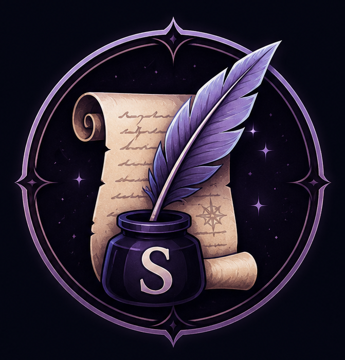

<div align="center">



# Scribe

### *The Memory of Your Adventure.*

**An AI-powered Discord companion that listens, understands and remembers every chapter of your tabletop RPG campaign.**


</div>

---

# 📖 About

Scribe is an intelligent assistant designed for tabletop RPG campaigns hosted on Discord.

Rather than simply transcribing voice conversations, Scribe understands the context of your sessions, identifies speakers, organizes events, tracks NPCs, quests, items and locations, and automatically builds a searchable campaign history.

Think of it as the chronicler sitting at your table.

---

# ✨ Features

## 🎙️ Real-time Voice Transcription

- Join Discord voice channels
- Capture each participant independently
- Real-time speech recognition
- Portuguese-first support

---

## 👥 Speaker Identification

- Know exactly who is speaking
- Separate players from the Dungeon Master
- Preserve dialogue structure

---

## 🎭 RPG Context Awareness

- Detect narration
- Detect NPC dialogue
- Detect player conversations
- Identify out-of-character discussions

---

## 📚 Campaign Memory

Automatically store:

- NPCs
- Locations
- Quests
- Items
- Encounters
- Important events

---

## 🧠 AI Session Analysis

Generate automatically:

- Session summaries
- Timeline
- Character interactions
- Story progression
- Pending quests

---

## 📄 Export

Export your campaign as:

- Markdown
- HTML
- PDF
- JSON

---

# 🚀 Roadmap

## v0.1

- [ ] Discord Bot
- [ ] Join Voice Channel
- [ ] Leave Voice Channel

---

## v0.2

- [ ] Receive voice packets
- [ ] Save audio
- [ ] Voice Activity Detection

---

## v0.3

- [ ] Faster Whisper integration
- [ ] Live transcription

---

## v0.4

- [ ] Speaker identification
- [ ] Session storage

---

## v0.5

- [ ] AI-powered summaries
- [ ] NPC extraction
- [ ] Quest tracking

---

## v1.0

- [ ] Stable release
- [ ] Campaign Manager
- [ ] Search engine
- [ ] Web Dashboard

---

# 🏗 Architecture

```
Discord Voice
        │
        ▼
 Voice Receiver
        │
        ▼
 Audio Processing
        │
        ▼
 Voice Activity Detection
        │
        ▼
 Speech-to-Text
        │
        ▼
 AI Analysis
        │
        ▼
 Campaign Memory
        │
        ▼
 Exporters
```

---

# 🛠 Tech Stack

| Layer | Technology |
|--------|------------|
| Language | Python 3.13 |
| Discord | discord.py |
| Speech Recognition | Faster Whisper |
| Voice Detection | Silero VAD |
| AI | OpenAI |
| Database | SQLite |
| Export | Markdown / HTML / PDF |
| Dependency Manager | uv |

---

# 📂 Project Structure

```
scribe/
│
├── assets/
├── docs/
├── src/
│   ├── bot/
│   ├── audio/
│   ├── transcription/
│   ├── ai/
│   ├── campaign/
│   ├── exporters/
│   └── database/
│
├── tests/
│
├── README.md
├── LICENSE
└── pyproject.toml
```

---

# 🎯 Vision

Scribe is not just a transcription bot.

Its mission is to become the memory of your campaign, preserving every decision, dialogue and adventure for years to come.

---

# ❤️ Contributing

Contributions are welcome!

If you'd like to improve Scribe, feel free to open an issue or submit a pull request.

---

# 📜 License

MIT License
